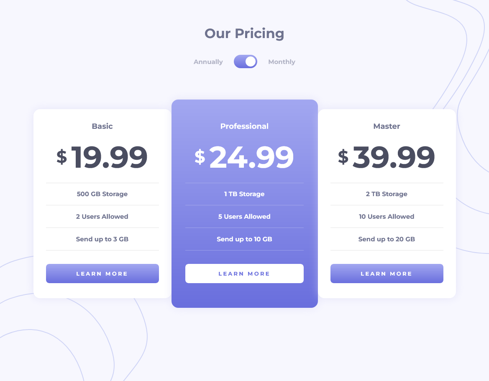

# Frontend Mentor - Pricing component with toggle solution

This is a solution to the [Pricing component with toggle challenge on Frontend Mentor](https://www.frontendmentor.io/challenges/pricing-component-with-toggle-8vPwRMIC). Frontend Mentor challenges help you improve your coding skills by building realistic projects. 

## Table of contents

- [Frontend Mentor - Pricing component with toggle solution](#frontend-mentor---pricing-component-with-toggle-solution)
  - [Table of contents](#table-of-contents)
  - [Overview](#overview)
    - [The challenge](#the-challenge)
    - [Screenshot](#screenshot)
    - [Links](#links)
  - [My process](#my-process)
    - [Built with](#built-with)
    - [What I learned](#what-i-learned)
    - [Useful resources](#useful-resources)
  - [Author](#author)


## Overview

### The challenge

Users should be able to:

- View the optimal layout for the component depending on their device's screen size
- Control the toggle with both their mouse/trackpad and their keyboard
- **Bonus**: Complete the challenge with just HTML and CSS

### Screenshot




### Links

- Solution URL: [Add solution URL here](https://your-solution-url.com)
- Live Site URL: [Add live site URL here](https://your-live-site-url.com)

## My process

### Built with

- Vanilla HTML CSS JS
- Flexbox
- Mobile-first workflow

### What I learned

First time styling a toggle from scratch with CSS. It turned out well.

Below is my implementation.

```html
<input type="checkbox" id="price-toggle">
<label for="price-toggle">toggle</label>
```
```css
#price-toggle {
  height: 0;
  width: 0;
  display: none;
}

label {
  cursor: pointer;
  display: inline-block;
  position: relative;
  text-indent: -9999px;
  width: 56px;
  height: 32px;
  background: linear-gradient(#a2a7f0, #696edd);
  border-radius: 50px;
}

label:after {
  content: "";
  position: absolute;
  background: white;
  width: 24px;
  height: 24px;
  top: 4px;
  left: 4px;
  border-radius: 30px;
  transition: 0.3s;
}

label:active:after {
  width: 30px;
}

input:checked + label:after {
  left: calc(100% - 4px);
  transform: translateX(-100%);
}
```

### Useful resources

- [CSS toggle example](https://codepen.io/mburnette/pen/LxNxNg) - I found this CodePen online and I referred to it heavily while writng up the CSS for the toggle.


## Author

- Frontend Mentor - [@andrew2764](https://www.frontendmentor.io/profile/andrew2764)
